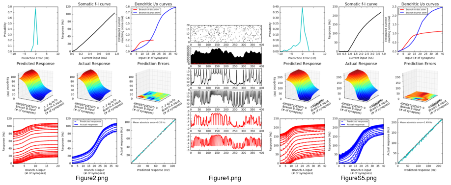

### NEURON simulation source code

Source code from 
Behabadi BF, Mel BW Mechanisms underlying subunit independence in pyramidal neuron dendrites PNAS. 2014;111(1)
[[pubmed]](https://www.ncbi.nlm.nih.gov/pubmed/24357611)

Adapted from [original ModelDB submission](https://senselab.med.yale.edu/ModelDB/ShowModel.cshtml?model=167694), updated to run inside companion docker image.

The code here reproduces Figures 2b-e, 4b-e, and S5b-f from the paper.

### Usage

    # create docker image
    cd docker && docker build -t neuron . && cd -

    # run simulations
    time docker run -it -v /full/path/to/bfb-bwm-2014:/nrn -w /nrn neuron ./runall.sh
    # This will generate 42 h5 files and 44 pkl files in data/ and 3 png files in figs/

### Notes

Figures 2 and S5 may not exactly match those in paper due to PRNG issues.
